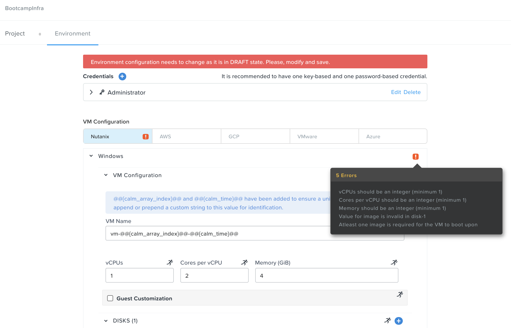
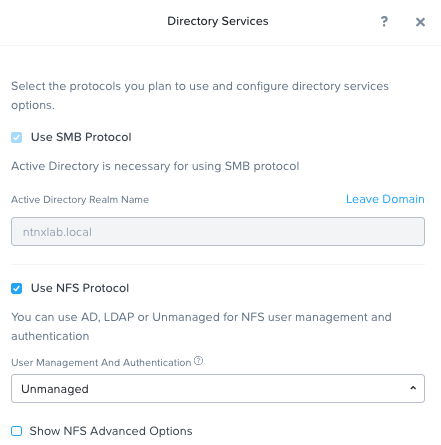

# Bootstrapping a SingleNode HPOC - Kalm Environment

The HPOC bootstrapping process assumes that the server was built using the following networking scheme

## Workflow

1. [Reserving Single Node HPOC Cluster](#reserving-single-node-hpoc-cluster)
1. [Setup Local Development Environment](../README.md#setup-local-development-environment)
1. [Bootstrap Calm Blueprints and Karbon Clusters - Single Node HPOC Cluster ONLY](#bootstrap-calm-blueprints-and-karbon-clusters---single-node-hpoc-cluster-only)
1. [Optional - Launch all available helm chart blueprints into Production Cluster](#optional-launch-all-available-helm-chart-blueprints-into-production-cluster)

## Reserving Single Node HPOC Cluster

1. Navigate to `https://rx.corp.nutanix.com/` hpoc reservation site and reserve cluster a single node hpoc (i.e., PHX-SPOC011-2) cluster.  This process takes roughly 3 hours to complete, but can be reserved on-demand or scheduled in advance.

    > `TIP 1`: During your reservation, set password to something you're familiar with as to avoid having to update creds within `.local\<environment>` path
        

    > `TIP 2`: Select the `Custom Workloads` option, and select the following options to ensure that you can start with a baseline deplyment of Objects, Calm, Karbon and Files:
        - `Core: Run LCM Updates & Upload OS Images`
        - `Files: Create File Server` - Needed for NFS Exports / ReadWriteMany PV Scenarios
        - `Calm`
        - `Karbon`
        - `Objects: Create Object Store` - Needed for Kasten Scenarios.
        

## Bootstrap Calm Blueprints and Karbon Clusters - Single Node HPOC Cluster ONLY

1. Bootstrap Nutanix Calm & Karbon `Production` (i.e., `kalm-main-{hpoc_id}`) Infratructure. [Additional Details](#bootstrapping-calm-blueprints--marketplace--karbon-kalm-main-hpoc-id-cluster)

    `make bootstrap-kalm-all ENVIRONMENT=kalm-main-{hpoc_id}`
    > EXAMPLE: `make bootstrap-kalm-all ENVIRONMENT=kalm-main-11-2`

## Launch all available helm chart blueprints into Production Cluster

1. Provision all available helm chart blueprints into `Production` (i.e., `kalm-main-{hpoc_id}`) cluster using test parameters

    `make launch-all-helm-charts ENVIRONMENT=kalm-main-{hpoc_id}`
    > EXAMPLE: `make launch-all-helm-charts ENVIRONMENT=kalm-main-11-2`

## Outstanding Manual Procedures

1. [Optional] - Configure Project `Environment` tab (e.g., credentials, vcpu, memory, image, etc.) to ensure that Launching of Marketplace Items are successful.

    

## Manual Staging of Additional Nutanix Services

### Configure Nutanix Files NFS (RWX Scenarios)

1. Enable Files Service via Prism Central for easier navigation between demo environments
1. Configure NFS Protocol / Export to be leveraged by Karbon
    
1. Configure NFS Export with Whitelist for Subnet

## Troubleshooting

