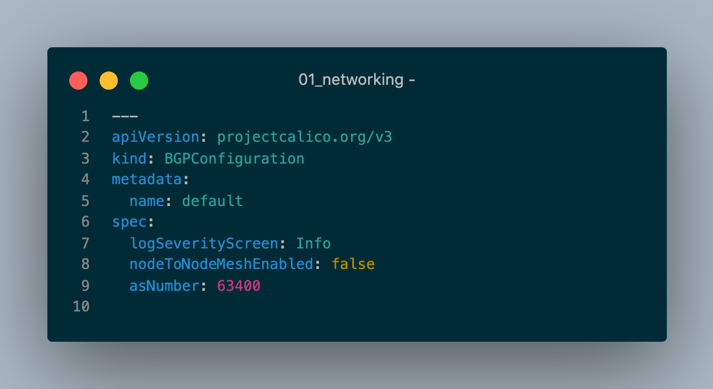
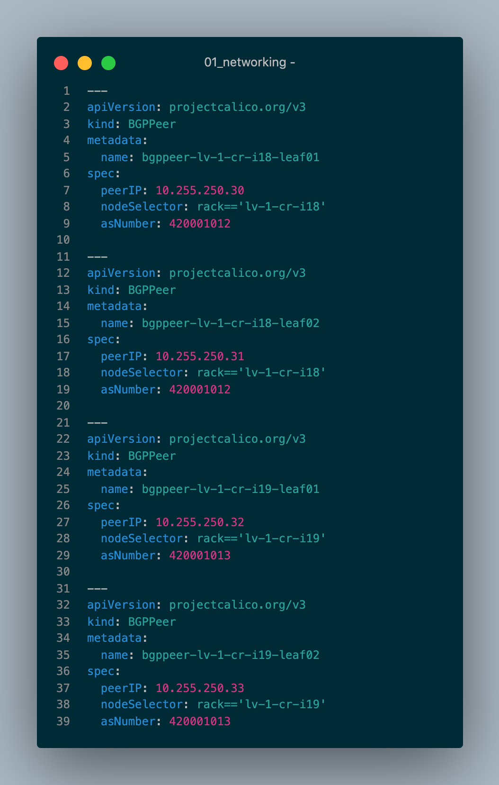
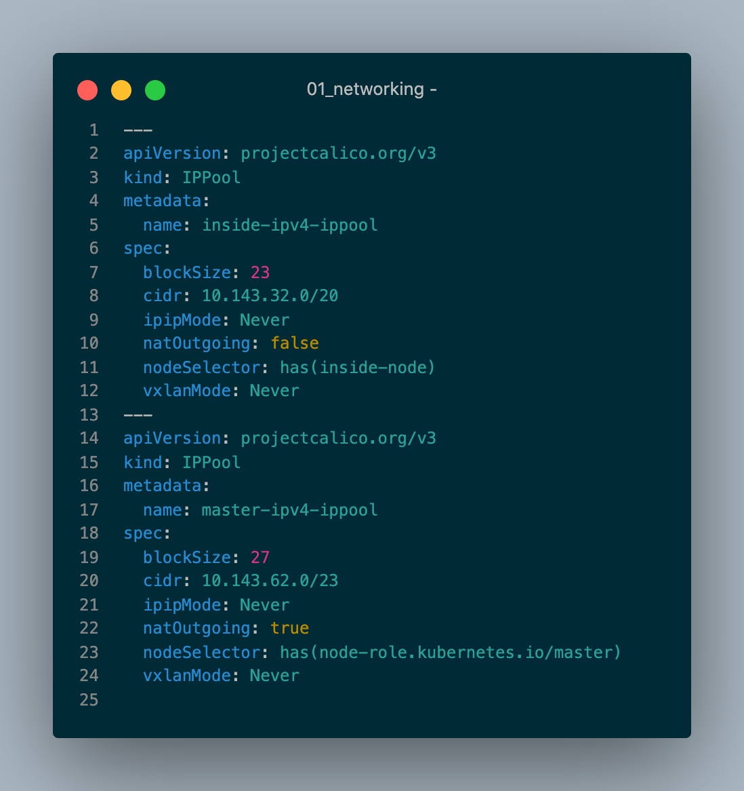
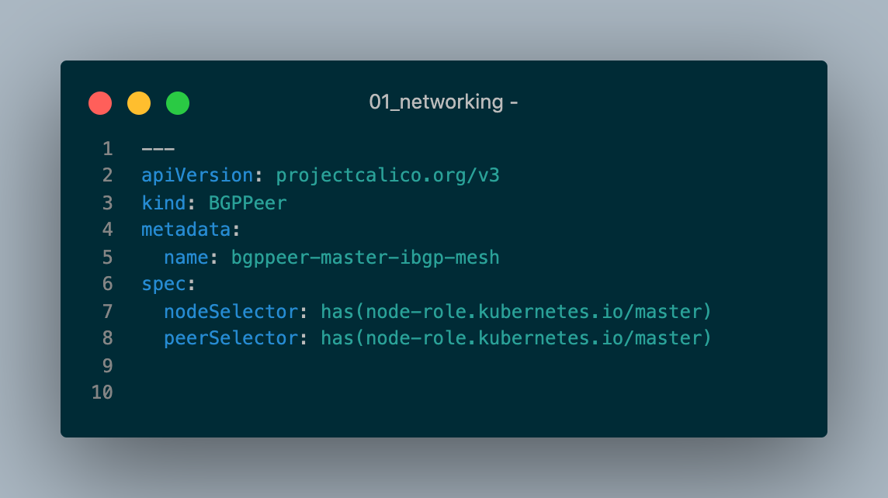

## 1. What are options to connecting to database instance without overhead of Proxies or Load Balancers

If Database are deployed within K8s cluster (typically as Statefulset), but DON'T need external connectivity access - the typical scenarios would be:

- Internal Clients (e.g., frontend apps / database clients) would connect to Internal ClusterIP Service for scenarios where it's ok to be Load Balanced between different DB replica instances
  - Internal DNS Lookup for Service will return ClusterIP Address that frontends all the database pod IPs.  The path taken would leverage kube-proxy/iptables pathway.
- Alternatively, Internal Clients could leverage `Headless` Services to connect to specific Stateful Pod / DB Replica Instance (i.e., secondary readonly instance) - https://kubernetes.io/docs/concepts/services-networking/service/#headless-services
  - With `Headless` Service, the ClusterIP attribute would be set to `None`, therefore no `ClusterIP` is allocated, `kube-proxy` won't be leveraged to handle services and there is no load balancing or proxying would be done by Kubernetes Platform. A DNS Service Lookup will simply return the Pod IP Address.
- In both cases, DNS is configured automatically based on whether or not the `Service` has `Selectors` defined
  - When `Selector` is defined, `Endpoints` are configured with Respective A Host Records in DNS (i.e., coredns) for each service / statefulset pod.

Alternatively, if database are external/outside the kubernetes clusters, then you'd want to leverage Service of type `ExternalName` and DNS CNAME lookups

- Without `Selector`, A `CNAME` records could be leveraged with `ExternalName` type as means of connecting to external service from within Kubernetes
  - https://kubernetes.io/docs/concepts/services-networking/service/#externalname
  - https://www.googblogs.com/kubernetes-best-practices-mapping-external-services/

Lastly, If Database are deployed within K8s cluster but need external connectivity access - the typical scenarios would be:

- Leverage Port Forwarding for temporary access
  - https://kubernetes.io/docs/tasks/access-application-cluster/port-forward-access-application-cluster/
- OR Leverage External DNS Operator and Headless Service (with type=NodePort) to Create DNS Records for External IP of Host(s) (vs PodIPs)
  - https://github.com/kubernetes-sigs/external-dns
  - https://github.com/kubernetes-sigs/external-dns/blob/master/docs/tutorials/hostport.md

Additional References if needed:

- https://cloud.google.com/blog/products/databases/to-run-or-not-to-run-a-database-on-kubernetes-what-to-consider
- https://kubernetes.io/docs/concepts/services-networking/dns-pod-service/
- https://kubernetes.io/docs/tasks/run-application/run-replicated-stateful-application/

## 2. Is there any step-by-step documentation on configuring Calico BGP (Border Gateway Protocol) Peering

At this time, there is no official step-by-step Nutanix documentation on how to configure BGP Peering within Karbon using Calico. However, it is worth noting that when Karbon installs and configures Calico, BGP is already enabled.  That is because Calico’s default behavior is to create a full-mesh of internal BGP (iBGP) connections where each node peers with each other.

This can be verified by running `sudo calicoctl node status` post Karbon deployment from one of the worker nodes

```bash
$ sudo calicoctl node status

IPv4 BGP status
+--------------+-------------------+-------+----------+-------------+
| PEER ADDRESS |     PEER TYPE     | STATE |  SINCE   |    INFO     |
+--------------+-------------------+-------+----------+-------------+
| 10.38.11.32  | node-to-node mesh | up    | 19:13:45 | Established |
| 10.38.11.47  | node-to-node mesh | up    | 19:15:19 | Established |
| 10.38.11.44  | node-to-node mesh | up    | 19:15:46 | Established |
| 10.38.11.41  | node-to-node mesh | up    | 19:16:17 | Established |
| 10.38.11.36  | node-to-node mesh | up    | 19:13:43 | Established |
| 10.38.11.52  | node-to-node mesh | up    | 19:13:43 | Established |
| 10.38.11.61  | node-to-node mesh | up    | 19:14:46 | Established |
| 10.38.11.56  | node-to-node mesh | up    | 19:14:16 | Established |
+--------------+-------------------+-------+----------+-------------+
```

Alternatively, you can configure Calico nodes to peer with route reflectors, or with top-of-rack (ToR) routers.

- https://projectcalico.docs.tigera.io/networking/bgp

It may also be worth nothing that we have had some customers configure Calico BGP peering directly with their physical network infrastructure using a combination of top-of-rack (ToR) leaf-spine switches/routers (as per-node bgp peers/ASNs) and custom nodeSelectors to control IP pool distribution between application and system pods.

#### Example Disabling Node to Node ServiceMesh

Default config for Karbon is Node to Node Service Mesh, so that would need to be disabled and ASN provided:



#### Example Per-Node BGP Peer Configurations



#### Example Multi-IPAM Pool with NodeSelectors

Below is example of Multiple IPAM Pool for handling master vs. worker node scenarios.



### Example Master BGP Peers config with NodeSelectors



### Simulation / Testing

If you're looking to do some level of testing without actual physical routers, you could leverage gobgp (https://github.com/osrg/gobgp) and the following documentation below to simulate various BGP configuration scenarios, and possibly validate how you wish to proceed towards your respective initiatives.

- https://projectcalico.docs.tigera.io/archive/v3.21/getting-started/kubernetes/hardway/configure-bgp-peering
- https://www.tkng.io/cni/calico/

Additional References if needed:

- https://projectcalico.docs.tigera.io/archive/v3.21/getting-started/kubernetes/hardway/
- https://learnk8s.io/kubernetes-network-packets

## 3. Is there a way to leverage Nutanix Karbon for AI/ML solutions, e.g., KubeFlow explicitly on BareMetal or Compute-Heavy Nodes

As of March 2022, the Karbon 2.4 release on added GPU pass-through support for Karbon node pools. This enables containerized use of GPU for AI/ML use cases with NVIDIA GPU.

It was also determined that Kubeflow is currently on roadmap to be certified as GPU Enabled Certified Solutions on Nutanix, but timeline on availability is obvious variable.

There are many resources that could be referenced for understanding AHV GPU Requirements, Karbon Capabilities/Limitations and step-by-step on how to enable below:

- Configuring GPU Operators on Karbon: https://portal.nutanix.com/page/documents/details?targetId=Karbon-v2_4:kar-karbon-gpu-configure-t.html
- Getting Started with GPU on Karbon Blog: https://www.nutanix.dev/2022/02/16/getting-started-with-gpu-on-nutanix-karbon/
- Supported GPUs: https://portal.nutanix.com/page/documents/details?targetId=AHV-Admin-Guide-v6_5:ahv-gpu-support-on-ahv-c.html
- GPU Pass-Through for Guest VMs: https://portal.nutanix.com/page/documents/details?targetId=AHV-Admin-Guide-v6_5:ahv-gpu-passthrough-for-guest-vms-intro-c.html

## 4. Leveraging Application Consistent Snapshots on Nutanix

It was also determined that there are efforts to enable Native Application Consistent Snapshots within Nutanix Data Services (e.g., Volumes and/or Files) and is currently on Roadmap.  In addition, Volume Cloning via CSI Driver for Nutanix Files is also currently on Roadmap

As an interim solution, third-party partner solutions such as Kasten K10 and S3 via Nutanix Objects could be leveraged to achieve the same objective.  

Below are examples:

- How to Protect Cloud Native Application Data with Kasten K10 and Nutanix Karbon: https://www.kasten.io/kubernetes/resources/blog/protect-cloud-native-appdata-kasten-k10-nutanix-karbon
- Application Consistent Backups with Kasten Kanister:
  - MongoDB Backup: https://docs.kasten.io/latest/kanister/mongodb/install_app_cons.html
  - PostGreSQL Backup: https://docs.kasten.io/latest/kanister/postgresql/install_app_cons.html

## 5. How can we automate the ETCD Backups (without manually logging into etcd node)

- Prerequisites:
  - Nutanix Karbon kubectl/krew plugin - https://github.com/nutanix/kubectl-karbon/blob/main/README.md
  - kubectl

- Procedures below are in alignment with documented ETCD Backup procedure:
  https://portal.nutanix.com/page/documents/details?targetId=Karbon-v2_4:kar-karbon-backing-up-etcd.html

```bash
## Set Prism Central and Target Karbon Cluster Details
PC_IP_ADDRESS=10.38.11.9
KARBON_CLUSTER=kalm-main-11-1
PC_USER=admin
PC_PASSWORD=<password>

## Get Karbon Kubeconfig File and SSH File
KARBON_PASSWORD=${PC_PASSWORD} kubectl-karbon login -k --server ${PC_IP_ADDRESS} --cluster ${KARBON_CLUSTER} --user ${PC_USER} --kubeconfig ~/.kube/${KARBON_CLUSTER}.cfg --force --ssh-file
export KUBECONFIG=~/.kube/${KARBON_CLUSTER}.cfg

## Set ETCD Variables needed for etcdctl
export ETCD_IP_0=$(kubectl get ep -n kube-system etcd -o jsonpath='{.subsets[].addresses[0].ip}')
export ETCD_IP_1=$(kubectl get ep -n kube-system etcd -o jsonpath='{.subsets[].addresses[1].ip}')
export ETCD_IP_2=$(kubectl get ep -n kube-system etcd -o jsonpath='{.subsets[].addresses[2].ip}')
export ETCDCTL_CACERT=/var/nutanix/etc/etcd/ssl/ca.pem
export ETCDCTL_CERT=/var/nutanix/etc/etcd/ssl/peer.pem
export ETCDCTL_KEY=/var/nutanix/etc/etcd/ssl/peer-key.pem
export ETCDCTL_ENDPOINTS="https://$ETCD_IP_0:2379,https://$ETCD_IP_1:2379,https://$ETCD_IP_2:2379"

## Set Alias for handling subsequent calls made directly from etcdctl
alias etcdctl='ssh -i ~/.ssh/${KARBON_CLUSTER} nutanix@${ETCD_IP_0} -C "sudo ETCDCTL_API=3 ETCDCTL_CACERT=${ETCDCTL_CACERT} ETCDCTL_CERT=${ETCDCTL_CERT} ETCDCTL_KEY=${ETCDCTL_KEY} etcdctl"'

## Validate Alias and ETCDCTL is setup correctly
etcdctl --endpoints=${ETCDCTL_ENDPOINTS} endpoint status --write-out=table

❯ etcdctl --endpoints=${ETCDCTL_ENDPOINTS} endpoint status --write-out=table
+--------------------------+------------------+---------+---------+-----------+------------+-----------+------------+--------------------+--------+
|         ENDPOINT         |        ID        | VERSION | DB SIZE | IS LEADER | IS LEARNER | RAFT TERM | RAFT INDEX | RAFT APPLIED INDEX | ERRORS |
+--------------------------+------------------+---------+---------+-----------+------------+-----------+------------+--------------------+--------+
| https://10.38.11.54:2379 | 11e2c57d5c8f22f8 |  3.3.17 |   25 MB |     false |      false |         2 |    1952796 |                  0 |        |
| https://10.38.11.31:2379 |  ee1d483e0a639cf |  3.3.17 |   25 MB |      true |      false |         2 |    1952796 |                  0 |        |
| https://10.38.11.35:2379 | 228ae1995af35bad |  3.3.17 |   24 MB |     false |      false |         2 |    1952796 |                  0 |        |
+--------------------------+------------------+---------+---------+-----------+------------+-----------+------------+--------------------+--------+

## Snapshot DB on initial instance

etcdctl --endpoints https://$ETCD_IP_0:2379 snapshot save /root/snapshot.db

## Write-out status to validate that snapshot db looks good

etcdctl --endpoints https://$ETCD_IP_0:2379 snapshot status /root/snapshot.db --write-out=table

❯ etcdctl --endpoints https://$ETCD_IP_0:2379 snapshot status /root/snapshot.db --write-out=table
+----------+----------+------------+------------+
|   HASH   | REVISION | TOTAL KEYS | TOTAL SIZE |
+----------+----------+------------+------------+
| 55403e8d |  1744319 |       2494 |      25 MB |
+----------+----------+------------+------------+
```

TODO:
- Get ETCD Restore
